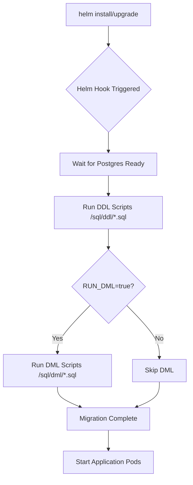

# Database Migrations in Helm

This document explains how database migrations work in Helm deployments.

## 📋 Overview

Database migrations are separated into **DDL** (schema) and **DML** (data):

```
sql/
├── ddl/   # Required schema changes - RUN AUTOMATICALLY
│   ├── 01-nexus-schema.sql
│   ├── 02-demo-schema.sql
│   ├── 05-query-history-enhancement.sql
│   └── 06-saved-queries-crud-enhancement.sql
│
└── dml/   # Optional demo data - RUN MANUALLY (opt-in)
    ├── 03-demo-data.sql
    └── 04-demo-data-extended.sql
```

---

## 🚀 How It Works

### Automatic Execution (Post-Install/Post-Upgrade)

When you run `helm install` or `helm upgrade`, a Kubernetes Job automatically:

1. ✅ **Always runs DDL** - Schema changes required for app functionality
2. ❓ **Conditionally runs DML** - Demo data only if `migrations.runDML: true`

### Helm Hooks

The migration job uses Helm hooks:
- `"helm.sh/hook": post-install,post-upgrade` - Runs after deployment
- `"helm.sh/hook-weight": "-5"` - Runs before other post-install hooks
- `"helm.sh/hook-delete-policy": before-hook-creation,hook-succeeded` - Cleans up old jobs

---

## 🔧 Configuration

### Development Environment (`values-dev.yaml`)

```yaml
migrations:
  runDML: true  # Include demo data for local development
```

### Production Environment (`values-production.yaml`)

```yaml
migrations:
  runDML: false  # Never run demo data in production
```

---

## 📝 Usage Examples

### Standard Deployment (DDL Only)

```bash
# Install with default values (DDL only)
helm install dashboard ./helm/dashboard \
  -f ./helm/dashboard/values-dev.yaml \
  -f ./helm/dashboard/values-dev-secrets.yaml

# ✅ DDL runs automatically
# ❌ DML skipped (no demo data)
```

### Development with Demo Data

```bash
# Install with demo data
helm install dashboard ./helm/dashboard \
  -f ./helm/dashboard/values-dev.yaml \
  -f ./helm/dashboard/values-dev-secrets.yaml \
  --set migrations.runDML=true

# ✅ DDL runs automatically
# ✅ DML runs (demo data loaded)
```

### Upgrade with Demo Data

```bash
# Upgrade existing deployment and add demo data
helm upgrade dashboard ./helm/dashboard \
  -f ./helm/dashboard/values-dev.yaml \
  -f ./helm/dashboard/values-dev-secrets.yaml \
  --set migrations.runDML=true

# ✅ DDL migrations applied (idempotent)
# ✅ DML demo data inserted
```

### Production Deployment

```bash
# Production: NEVER include demo data
helm install dashboard ./helm/dashboard \
  -f ./helm/dashboard/values-production.yaml \
  --set migrations.runDML=false  # Explicit for safety

# ✅ DDL only
# ❌ No demo data
```

---

## 🔍 Verification

### Check Migration Job Status

```bash
# View migration job logs
kubectl logs -n dashboard job/dashboard-db-migration

# Check job status
kubectl get jobs -n dashboard | grep migration

# View ConfigMaps
kubectl get configmaps -n dashboard | grep postgres
```

### Verify Database Schema

```bash
# Connect to postgres pod
kubectl exec -n dashboard -it deployment/dashboard-postgres -- bash

# Check tables
psql -U nexus_service -d dashboard -c "\dt nexus.*"

# Check if new columns exist
psql -U nexus_service -d dashboard -c "\d nexus.query_history"
```

### Check Demo Data

```bash
# Count records in demo tables
kubectl exec -n dashboard deployment/dashboard-postgres -- \
  psql -U nexus_service -d dashboard \
  -c "SELECT 'customers', COUNT(*) FROM demo_ecommerce.customers"
```

---

## 🏗️ How It's Implemented

### 1. ConfigMaps (`postgres-init.yaml`)

Two separate ConfigMaps are created:

```yaml
# DDL ConfigMap
apiVersion: v1
kind: ConfigMap
metadata:
  name: dashboard-postgres-ddl
data:
  # All files from sql/ddl/*.sql
  
# DML ConfigMap  
apiVersion: v1
kind: ConfigMap
metadata:
  name: dashboard-postgres-dml
data:
  # All files from sql/dml/*.sql
```

### 2. Migration Job (`db-migration-job.yaml`)

Kubernetes Job that:
- Mounts both ConfigMaps (DDL at `/sql/ddl`, DML at `/sql/dml`)
- Runs as a Helm hook (`post-install`, `post-upgrade`)
- Executes DDL scripts unconditionally
- Executes DML scripts only if `RUN_DML=true`

### 3. Environment Variable

The job reads the `migrations.runDML` value from Helm:

```yaml
env:
  - name: RUN_DML
    value: {{ .Values.migrations.runDML | default "false" | quote }}
```

---

## 🎯 Benefits

| Aspect | Benefit |
|--------|---------|
| **Faster Deployments** | DDL runs in seconds, not minutes |
| **Production Safe** | No demo data accidentally deployed |
| **Developer Friendly** | Easy to toggle demo data |
| **CI/CD Optimized** | Tests run fast without large datasets |
| **Declarative** | Controlled via values files |
| **Idempotent** | Safe to re-run migrations |

---

## 🐛 Troubleshooting

### Migration Job Failed

```bash
# View job logs
kubectl logs -n dashboard job/dashboard-db-migration

# View job events
kubectl describe job -n dashboard dashboard-db-migration

# Common issues:
# 1. Database not ready -> Job will retry automatically
# 2. Syntax error in SQL -> Check SQL file syntax
# 3. Duplicate key -> Migrations not idempotent (add IF NOT EXISTS)
```

### Need to Re-run Migrations

```bash
# Delete the old job
kubectl delete job -n dashboard dashboard-db-migration

# Trigger a new migration by upgrading
helm upgrade dashboard ./helm/dashboard \
  -f ./helm/dashboard/values-dev.yaml \
  --reuse-values
```

### Want to Run DML Manually

```bash
# Connect to postgres pod
kubectl exec -n dashboard -it deployment/dashboard-postgres -- bash

# Run DML script
cd /sql/dml
psql -U nexus_service -d dashboard -f 03-demo-data.sql
```

### Check What Will Be Deployed

```bash
# Dry-run to see what migrations will execute
helm template dashboard ./helm/dashboard \
  -f ./helm/dashboard/values-dev.yaml \
  --set migrations.runDML=true \
  | grep -A 20 "kind: Job"
```

---

## 📚 Related Files

- `templates/postgres-init.yaml` - ConfigMap definitions
- `templates/db-migration-job.yaml` - Migration job definition
- `values-dev.yaml` - Development configuration
- `values-production.yaml` - Production configuration
- `sql/README.md` - SQL files documentation

---

## 🔄 Migration Workflow



---

## ✅ Best Practices

1. **Development**: Set `migrations.runDML: true` for demo data
2. **Staging**: Set `migrations.runDML: false` to match production
3. **Production**: Always set `migrations.runDML: false`
4. **CI/CD**: Use `--set migrations.runDML=false` in pipelines
5. **Testing**: Create separate DML files for test data vs demo data

---

## 📝 Adding New Migrations

### Adding DDL (Schema Changes)

1. Create file in `sql/ddl/` with sequential number:
   ```
   sql/ddl/07-add-new-feature.sql
   ```

2. Use idempotent SQL:
   ```sql
   ALTER TABLE nexus.users 
     ADD COLUMN IF NOT EXISTS phone VARCHAR(20);
   ```

3. Deploy:
   ```bash
   helm upgrade dashboard ./helm/dashboard --reuse-values
   ```

### Adding DML (Demo Data)

1. Create file in `sql/dml/`:
   ```
   sql/dml/05-new-demo-data.sql
   ```

2. Deploy with DML enabled:
   ```bash
   helm upgrade dashboard ./helm/dashboard \
     --set migrations.runDML=true
   ```

---

**Questions?** Check the main README or the Docker migration docs!

